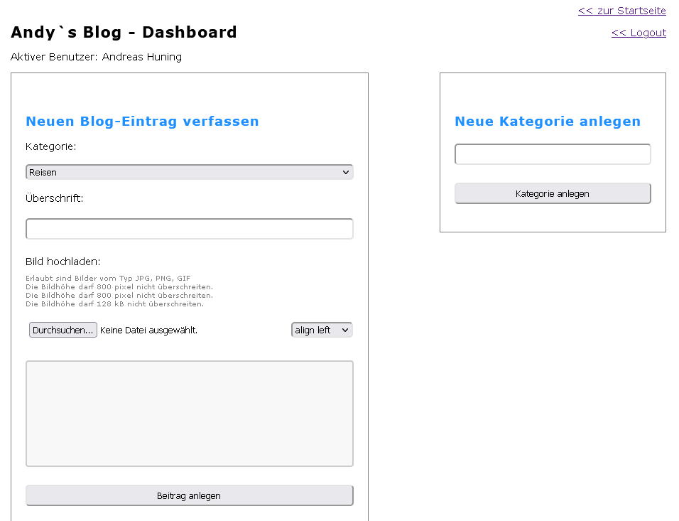

# Blog mit PHP

Daten in das XAMPP htdocs Verzeichnis kopieren
Apache und SQL Server in XAMPP starten

SQL:
phpmyadmin aufrufen: http://localhost/phpmyadmin/
Datenbank "blog.sql" aus dem Ordner _sql im phpmyadmin importieren

Login: 
Mail: admin@admin.de
Passwort: 1234

Auf der Startseite werden alle Beiträge angezeigt

Im Dashboard können Kategorien und Beiträge angelegt werden

